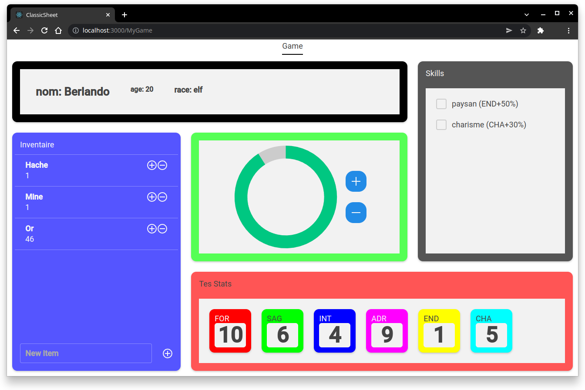

# UXifier

**Course:** Domain-specific languages

**Supervisors:** J. Deantoni

**Date:** February 2022 - March 2022

## Description



Domain-specific language to build an RPG character sheet as a web application.

## Structure

- [package.json](package.json): Manifest file declaring the language support.
- [language-configuration.json](language-configuration.json): Language configuration defining the tokens that are used for comments and brackets.
- [src/](src): Source files.
  - [extension.ts](src/extension.ts): Main code of the extension, which is responsible for launching a language server and client.
  - [language-server/](src/language-server): Source files of the language server.
    - [main.ts](src/language-server/main.ts): Entry point of the language server.
    - [uxifier.langium](src/language-server/uxifier.langium): Grammar definition of the language.
    - [uxifier-module.ts](src/language-server/uxifier-module.ts): Dependency injection module of the language.
    - [uxifier-validator.ts](src/language-server/uxifier-validator.ts): Validation methods of the language.
  - [cli/](src/cli): Source files of the command-line interface.
    - [index.ts](src/cli/index.ts): Entry point of the command-line interface of the language.
    - [utils.ts](src/cli/utils.ts): Utility code for the command-line interface.
    - [commands/](src/cli/commands): Source code of the commands provided by the CLI.
    - [generators/](src/cli/generators): Code generators used by the CLI to write output files from DSL documents.

## Requirements

- [Node.js](https://nodejs.org/en/download/).
- [Visual Studio Code](https://code.visualstudio.com).

## Compile the extension

- Install the dependencies:

```bash
npm install
```

- Generate TypeScript code from the grammar definition:

```bash
npm run langium:generate
```

- Compile the extension:

```bash
npm run build
```


## Try the extension

- Open this repository with VS Code.
- Press `F5` to open a new window with the extension loaded.
- Create a new file with the `.uxfr` or `.uxf` extension.
- Enjoy syntax highlighting, validation, completion, and more!

## Use the CLI

- Install the CLI:

```bash
npm install -g ./
```

> Please check that the modules installed globally by NPM are available from anywhere on your machine.

- Compile a project file:

```bash
uxifier generate file.uxfr
```

- Watch a project file to compile it on every modification:

```bash
uxifier watch file.uxfr
```

## Install the extension

- To install the extension, copy it into the `<user home>/.vscode/extensions` folder and restart VS Code.

## Authors

- [João Brilhante](https://github.com/JoaoBrlt)
- [Enzo Briziarelli](https://github.com/enbriziare)
- [Charly Ducrocq](https://github.com/CharlyDucrocq)
- [Quentin Larose](https://github.com/QuentinLarose)
- [Ludovic Marti](https://github.com/LudovicMarti)
